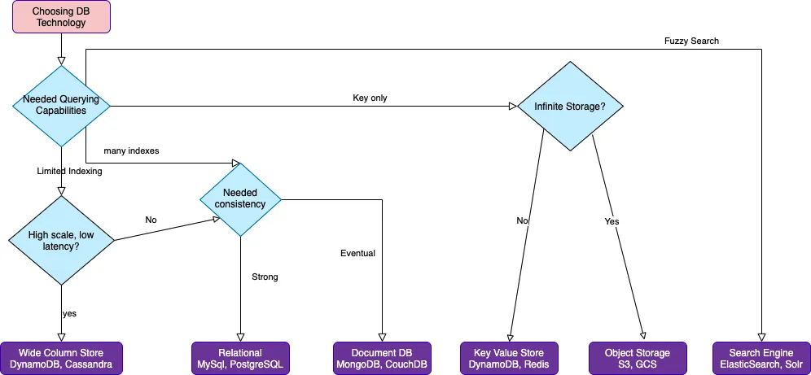

# research-paper-on-db

How to choose database for your application?

## [Outline of research paper](./docs/outline.md)

## [What is a database?](./docs/what-is-a-database.md)

## [What types of databases are there?](./docs/what-types-of-databases-are-there.md)

## [Criteria to keep in mind while choosing database](./docs/criterias-to-keep-in-mind.md)

## [Examples of each type](./docs/examples-of-each-type.md)

## [Research Paper](./docs/research-paper.md)

## Flowchart

